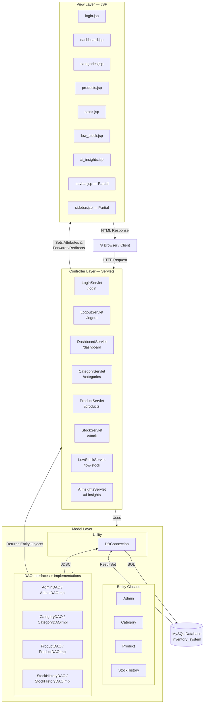
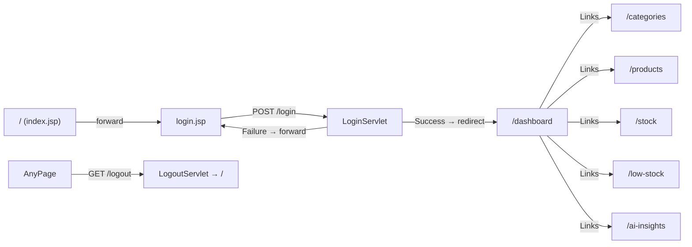

# Architecture Overview — Inventory System

## Technology Stack

| Layer | Technology |
|---|---|
| Language | Java 21 |
| Web Framework | Jakarta Servlet / JSP (Jakarta EE 10) |
| View Engine | JSP + JSTL 3.x |
| Database | MySQL 8.x |
| JDBC Driver | MySQL Connector/J 9.0.0 |
| Build Tool | Maven 3.x (WAR packaging) |
| Deployment | Apache Tomcat (Servlet Container) |

---

## MVC Design Pattern

The application strictly follows the **Model-View-Controller (MVC)** architectural pattern implemented using the **Jakarta Servlet + JSP** stack. All routing is annotation-driven (`@WebServlet`).



---

## Layer Responsibilities

### Controller Layer (Servlets)
- Receives HTTP requests (GET / POST)
- Validates session authentication
- Reads request parameters
- Delegates all data operations to DAOs
- Sets response attributes and forwards to the appropriate JSP view

### Model Layer
**Entities** — Plain Java Objects (POJOs) representing domain objects:
- `Admin`, `Category`, `Product`, `StockHistory`

**DAO Interfaces** — Define the data contract (what operations are available):
- `AdminDAO`, `CategoryDAO`, `ProductDAO`, `StockHistoryDAO`

**DAO Implementations** — Contain all SQL logic using JDBC `PreparedStatement`:
- Located under `dao/impl/` package

**DBConnection** — Singleton-style static utility that opens a new JDBC connection per call using `DriverManager`.

### View Layer (JSP)
- Renders HTML using JSTL and EL (Expression Language)
- Receives data as `request.setAttribute(...)` from controllers
- Shared layout components: `navbar.jsp`, `sidebar.jsp` (included via `<%@ include %>`)
- All JSPs are secured under `WEB-INF/` (not directly accessible by URL)

---

## Application Entry Point & Routing



**Session-based Authentication:**
All protected servlets check for `session.getAttribute("loggedInAdmin")`. If `null`, they redirect to the login page. The session is invalidated on logout.

---

## Package Structure

```
com.inventorysystem
├── controller/          ← 8 Servlets (Controllers)
│   ├── LoginServlet.java
│   ├── LogoutServlet.java
│   ├── DashboardServlet.java
│   ├── CategoryServlet.java
│   ├── ProductServlet.java
│   ├── StockServlet.java
│   ├── LowStockServlet.java
│   └── AIInsightsServlet.java
├── dao/                 ← 4 DAO Interfaces
│   ├── AdminDAO.java
│   ├── CategoryDAO.java
│   ├── ProductDAO.java
│   ├── StockHistoryDAO.java
│   └── impl/           ← 4 DAO Implementations
│       ├── AdminDAOImpl.java
│       ├── CategoryDAOImpl.java
│       ├── ProductDAOImpl.java
│       └── StockHistoryDAOImpl.java
├── model/               ← 4 Entity Classes
│   ├── Admin.java
│   ├── Category.java
│   ├── Product.java
│   └── StockHistory.java
└── utility/             ← Infrastructure
    ├── DBConnection.java
    ├── CategoryDAOTest.java
    └── TestDBConnection.java

webapp/
├── index.jsp            ← Entry point (forwards to login)
├── WEB-INF/
│   ├── web.xml          ← Deployment descriptor
│   ├── views/           ← JSP Views (7 pages)
│   │   ├── login.jsp
│   │   ├── dashboard.jsp
│   │   ├── categories.jsp
│   │   ├── products.jsp
│   │   ├── stock.jsp
│   │   ├── low_stock.jsp
│   │   └── ai_insights.jsp
│   └── partials/        ← Reusable JSP fragments
│       ├── navbar.jsp
│       └── sidebar.jsp
└── assets/
    ├── css/
    ├── js/
    └── images/
```
