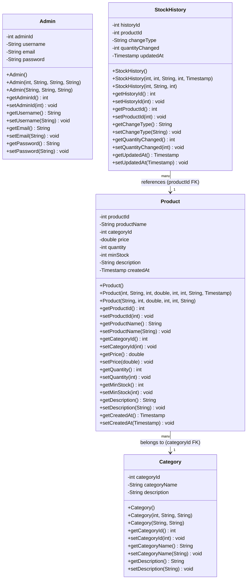
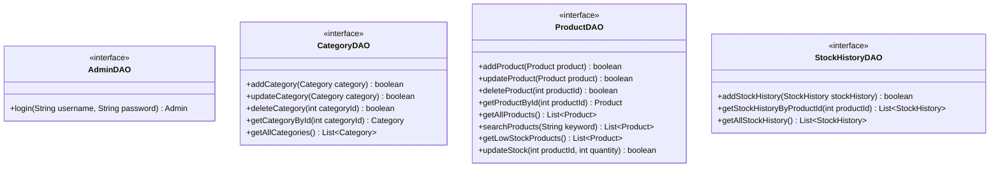
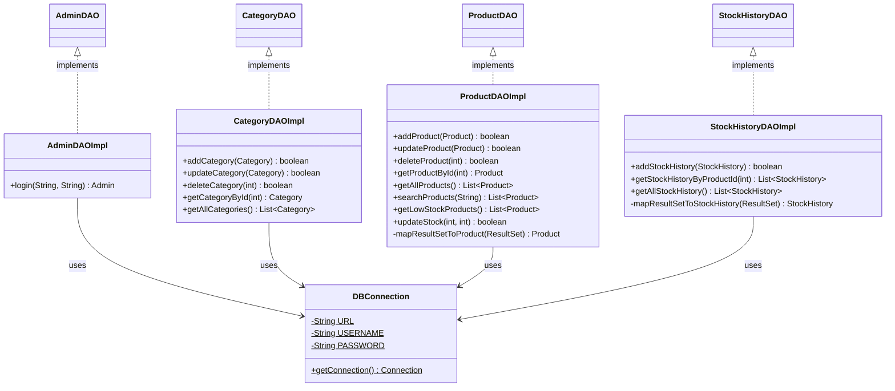
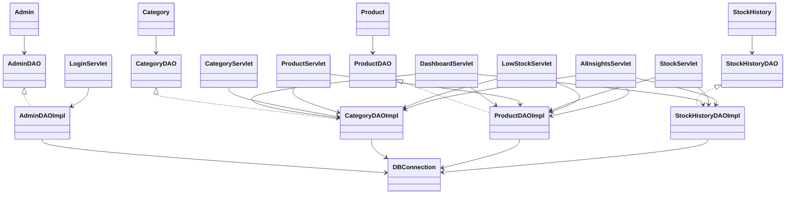

# Class Diagrams — Inventory System

## 1. Model (Entity) Classes

These are plain Java objects (POJOs) representing the domain entities. Each entity maps directly to a database table.

---

## 2. DAO Interface Layer

---

## 3. DAO Implementation Layer

---

## 4. Controller Layer (Servlets)

```mermaid
classDiagram
    class HttpServlet {
        <<abstract>>
        +doGet(HttpServletRequest, HttpServletResponse) void
        +doPost(HttpServletRequest, HttpServletResponse) void
        +init() void
    }

    class LoginServlet {
        -AdminDAO adminDAO
        +init() void
        +doPost(HttpServletRequest, HttpServletResponse) void
    }

    class LogoutServlet {
        +doGet(HttpServletRequest, HttpServletResponse) void
    }

    class DashboardServlet {
        -ProductDAO productDAO
        -CategoryDAO categoryDAO
        -StockHistoryDAO stockHistoryDAO
        +init() void
        +doGet(HttpServletRequest, HttpServletResponse) void
    }

    class CategoryServlet {
        -CategoryDAO categoryDAO
        +init() void
        +doGet(HttpServletRequest, HttpServletResponse) void
        +doPost(HttpServletRequest, HttpServletResponse) void
        -listCategories(HttpServletRequest, HttpServletResponse) void
        -addCategory(HttpServletRequest, HttpServletResponse) void
        -deleteCategory(HttpServletRequest, HttpServletResponse) void
        -showEditCategory(HttpServletRequest, HttpServletResponse) void
        -updateCategory(HttpServletRequest, HttpServletResponse) void
    }

    class ProductServlet {
        -ProductDAO productDAO
        -CategoryDAO categoryDAO
        +init() void
        +doGet(HttpServletRequest, HttpServletResponse) void
        +doPost(HttpServletRequest, HttpServletResponse) void
        -listProducts(HttpServletRequest, HttpServletResponse) void
        -addProduct(HttpServletRequest, HttpServletResponse) void
        -deleteProduct(HttpServletRequest, HttpServletResponse) void
        -showEditProduct(HttpServletRequest, HttpServletResponse) void
        -updateProduct(HttpServletRequest, HttpServletResponse) void
        -searchProducts(HttpServletRequest, HttpServletResponse) void
    }

    class StockServlet {
        -ProductDAO productDAO
        -StockHistoryDAO stockHistoryDAO
        +init() void
        +doGet(HttpServletRequest, HttpServletResponse) void
        +doPost(HttpServletRequest, HttpServletResponse) void
    }

    class LowStockServlet {
        -ProductDAO productDAO
        -CategoryDAO categoryDAO
        +init() void
        +doGet(HttpServletRequest, HttpServletResponse) void
    }

    class AIInsightsServlet {
        -ProductDAO productDAO
        -CategoryDAO categoryDAO
        -StockHistoryDAO stockHistoryDAO
        +init() void
        +doGet(HttpServletRequest, HttpServletResponse) void
    }

    HttpServlet <|-- LoginServlet
    HttpServlet <|-- LogoutServlet
    HttpServlet <|-- DashboardServlet
    HttpServlet <|-- CategoryServlet
    HttpServlet <|-- ProductServlet
    HttpServlet <|-- StockServlet
    HttpServlet <|-- LowStockServlet
    HttpServlet <|-- AIInsightsServlet

    LoginServlet --> AdminDAO : uses
    DashboardServlet --> ProductDAO : uses
    DashboardServlet --> CategoryDAO : uses
    DashboardServlet --> StockHistoryDAO : uses
    CategoryServlet --> CategoryDAO : uses
    ProductServlet --> ProductDAO : uses
    ProductServlet --> CategoryDAO : uses
    StockServlet --> ProductDAO : uses
    StockServlet --> StockHistoryDAO : uses
    LowStockServlet --> ProductDAO : uses
    LowStockServlet --> CategoryDAO : uses
    AIInsightsServlet --> ProductDAO : uses
    AIInsightsServlet --> CategoryDAO : uses
    AIInsightsServlet --> StockHistoryDAO : uses
```

---

## 5. Complete System Class Diagram (Condensed)

