# Sequence Diagrams — All Application Flows

## Flow 1 — User Login

**Servlet:** `LoginServlet` (`POST /login`)  
**DAO Used:** `AdminDAO → AdminDAOImpl`

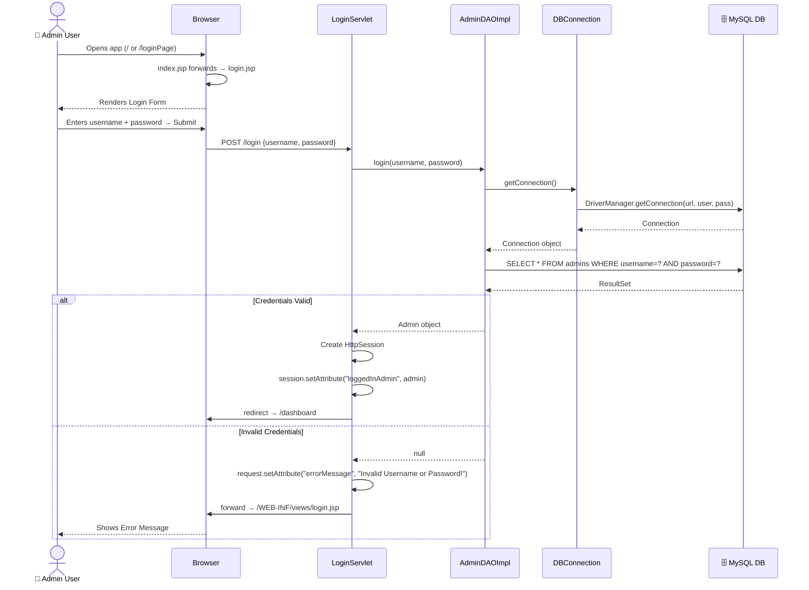

---

## Flow 2 — User Logout

**Servlet:** `LogoutServlet` (`GET /logout`)

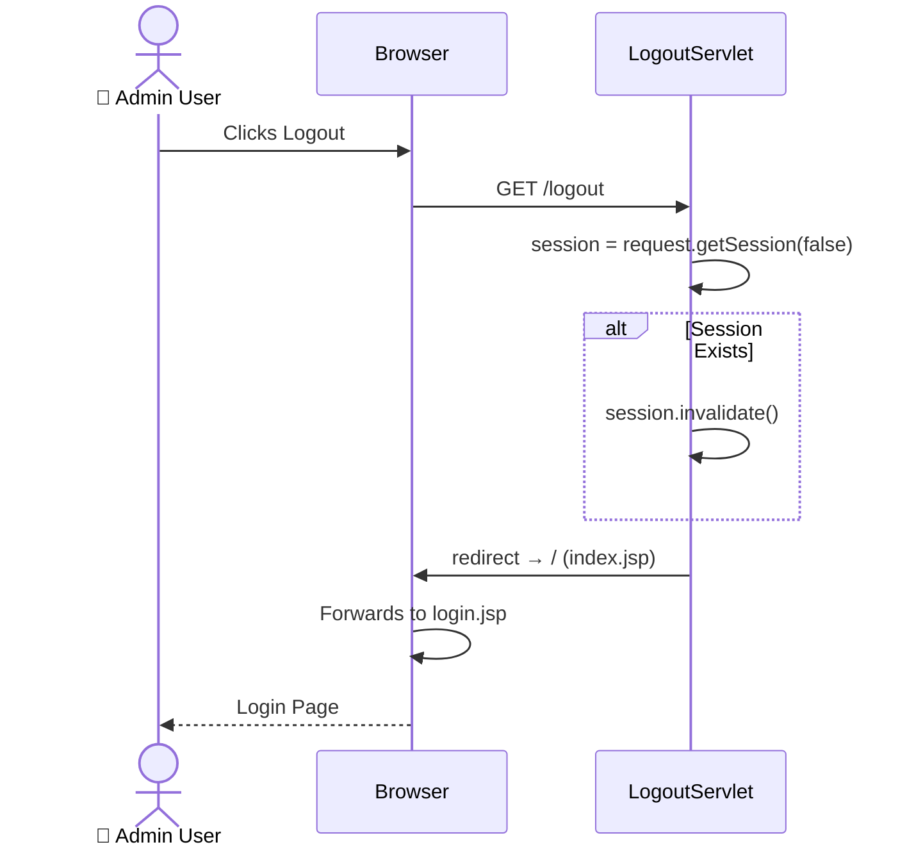

---

## Flow 3 — Dashboard Load

**Servlet:** `DashboardServlet` (`GET /dashboard`)  
**DAOs Used:** `ProductDAO`, `CategoryDAO`, `StockHistoryDAO`

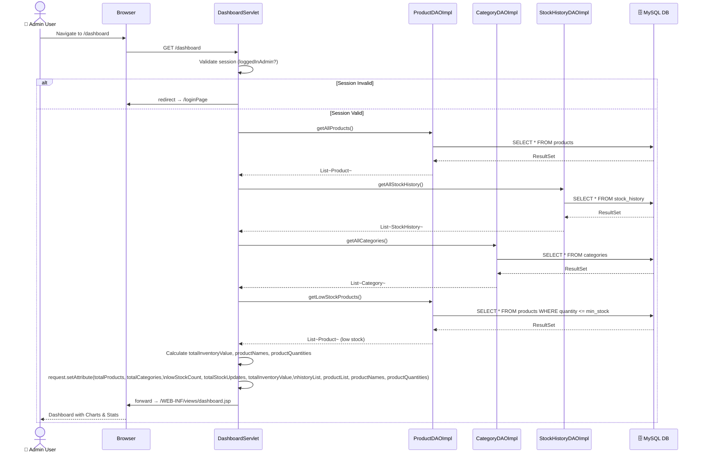

---

## Flow 4 — List All Categories

**Servlet:** `CategoryServlet` (`GET /categories`)  
**DAO Used:** `CategoryDAO`

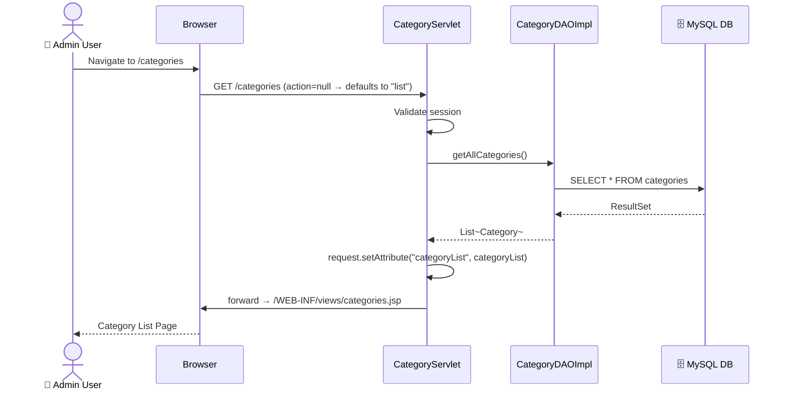

---

## Flow 5 — Add Category

**Servlet:** `CategoryServlet` (`POST /categories`)

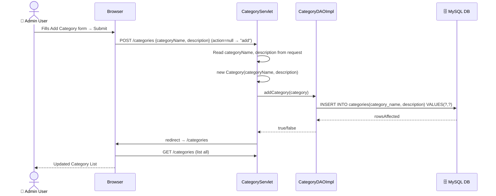

---

## Flow 6 — Edit / Update Category

**Servlet:** `CategoryServlet` (`GET /categories?action=edit` → `POST /categories?action=update`)

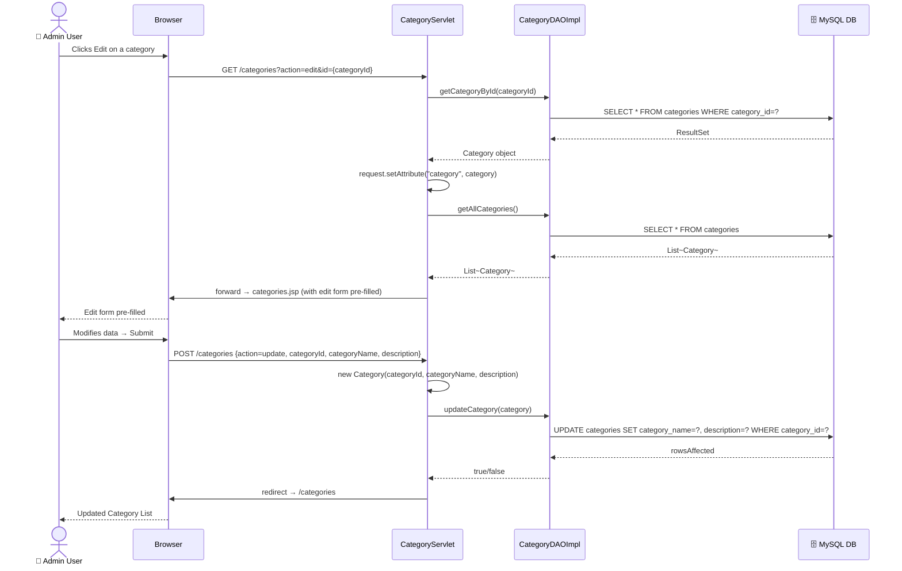

---

## Flow 7 — Delete Category

**Servlet:** `CategoryServlet` (`GET /categories?action=delete&id={id}`)

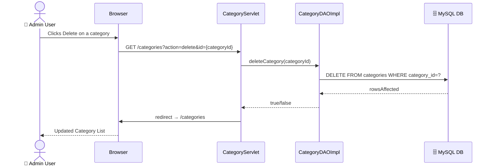

---

## Flow 8 — List All Products

**Servlet:** `ProductServlet` (`GET /products`)  
**DAOs Used:** `ProductDAO`, `CategoryDAO`

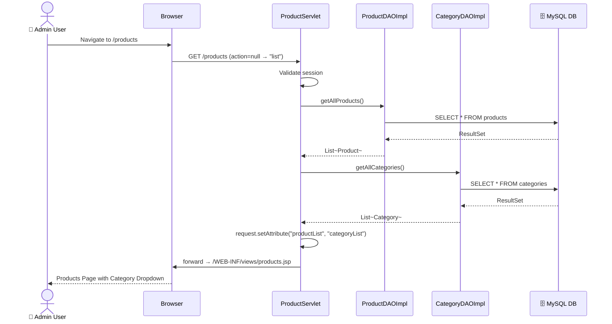

---

## Flow 9 — Add Product

**Servlet:** `ProductServlet` (`POST /products`)

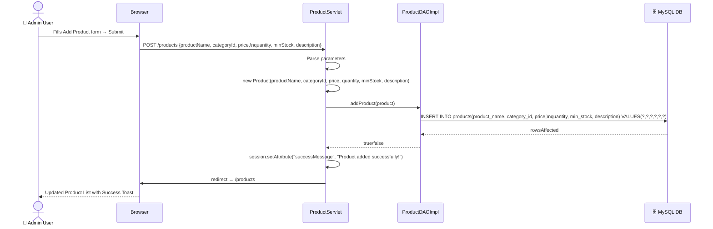

---

## Flow 10 — Edit / Update Product

**Servlet:** `ProductServlet` (`GET /products?action=edit` → `POST /products?action=update`)

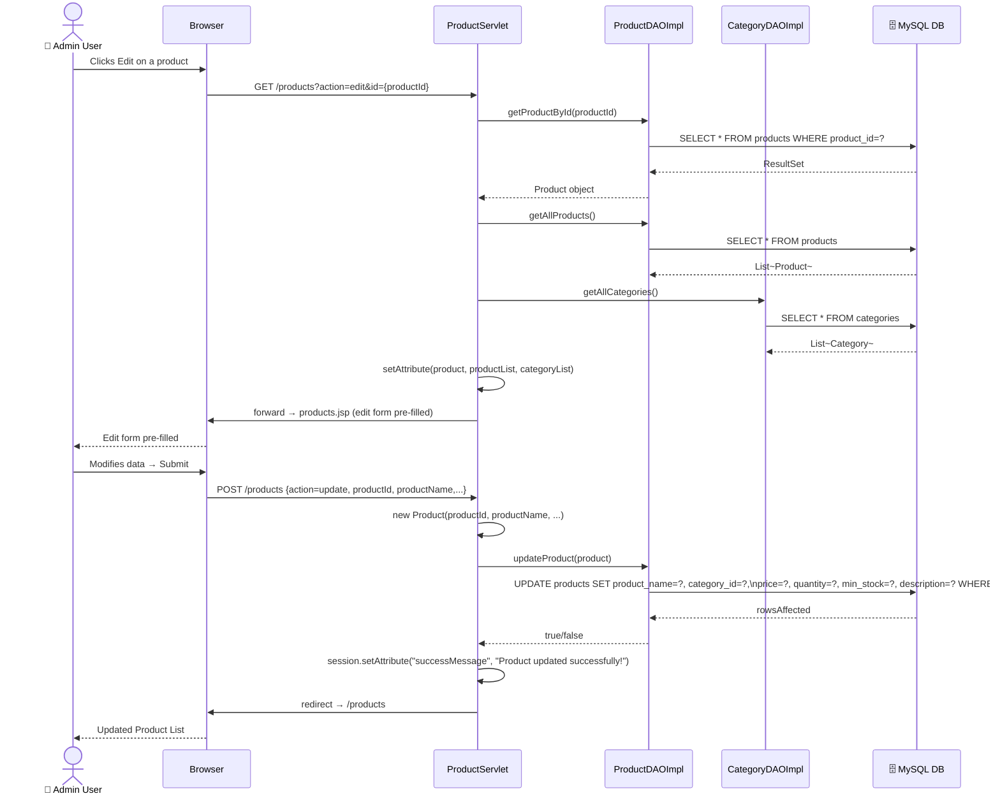

---

## Flow 11 — Search Products

**Servlet:** `ProductServlet` (`GET /products?action=search&keyword={keyword}`)

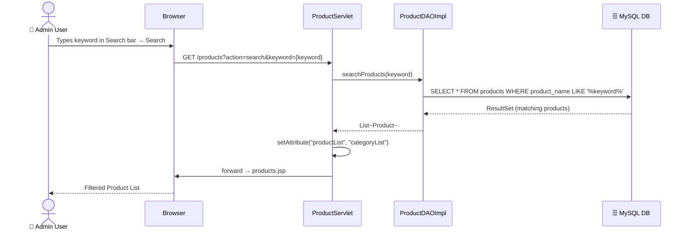

---

## Flow 12 — Delete Product

**Servlet:** `ProductServlet` (`GET /products?action=delete&id={id}`)

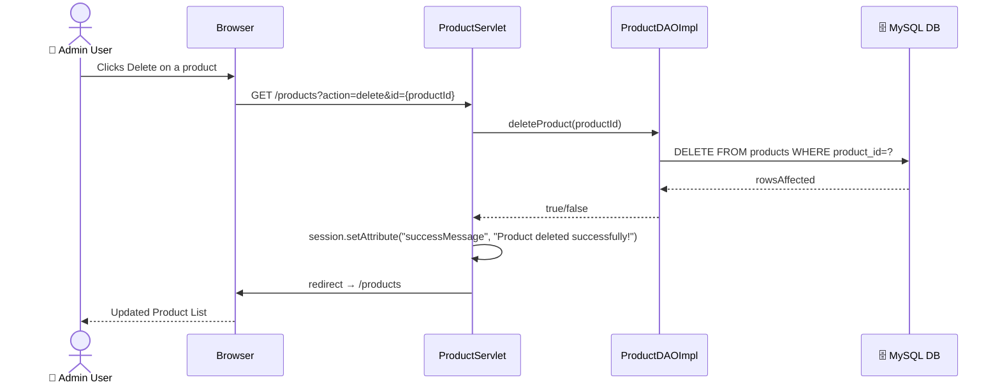

---

## Flow 13 — Stock Management (IN / OUT)

**Servlet:** `StockServlet` (`GET /stock` → `POST /stock`)  
**DAOs Used:** `ProductDAO`, `StockHistoryDAO`

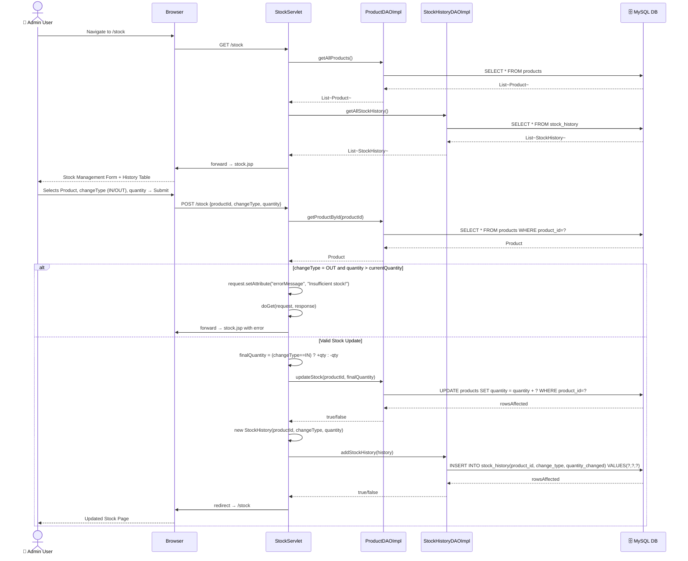

---

## Flow 14 — Low Stock Alert View

**Servlet:** `LowStockServlet` (`GET /low-stock`)  
**DAOs Used:** `ProductDAO`, `CategoryDAO`

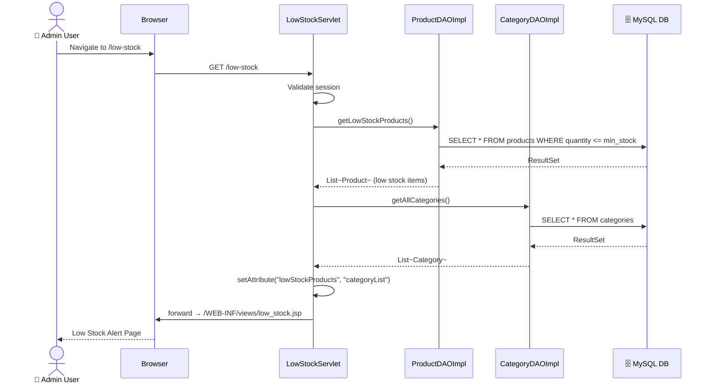

---

## Flow 15 — AI Insights View

**Servlet:** `AIInsightsServlet` (`GET /ai-insights`)  
**DAOs Used:** `ProductDAO`, `CategoryDAO`, `StockHistoryDAO`

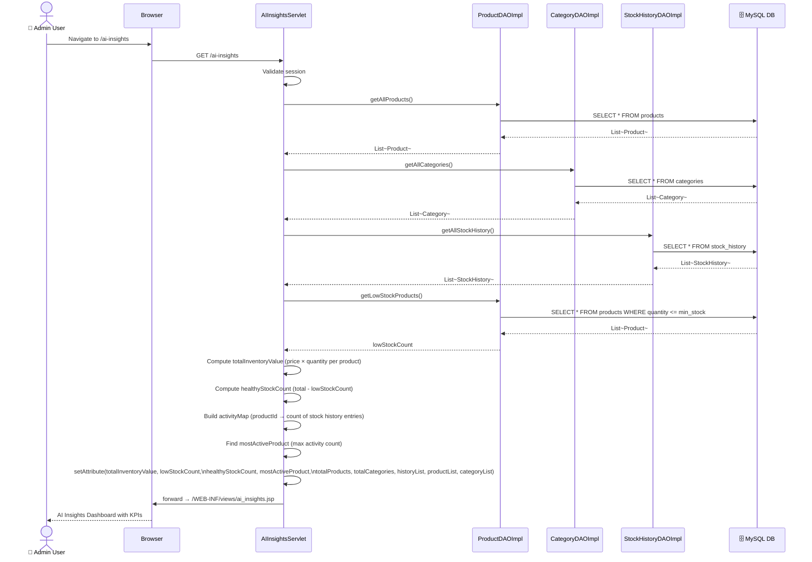
