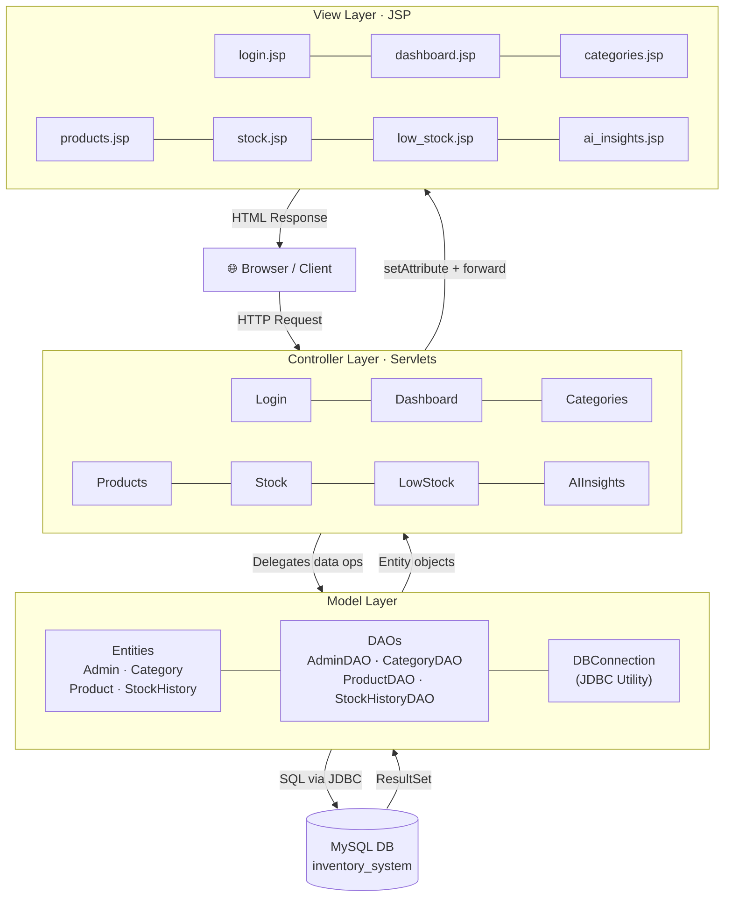
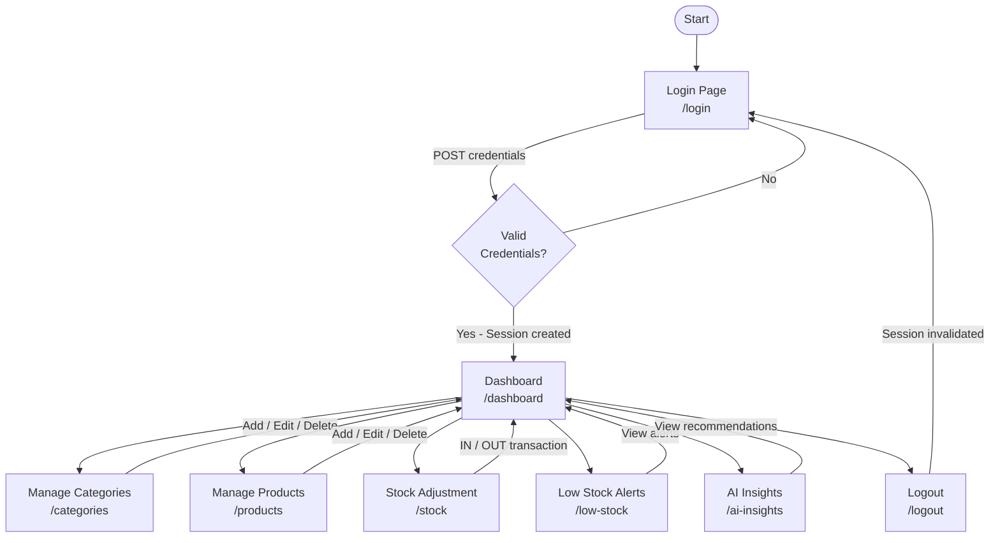

# System Diagrams — Inventory System

---

## 1. System Architecture Diagram

> Shows the three-layer MVC structure and how each layer communicates.

---

## 2. User Workflow Flowchart

> Traces the full user journey through the application.

---

## Key Components Summary

| Component | Technology | Role |
|---|---|---|
| **View** | JSP + JSTL | Renders HTML pages |
| **Controller** | Jakarta Servlet | Handles HTTP, session auth |
| **Model / DAO** | Java POJOs + JDBC | Business entities & DB queries |
| **Database** | MySQL 8 | Persistent data store |
| **Container** | Apache Tomcat | Servlet runtime |
